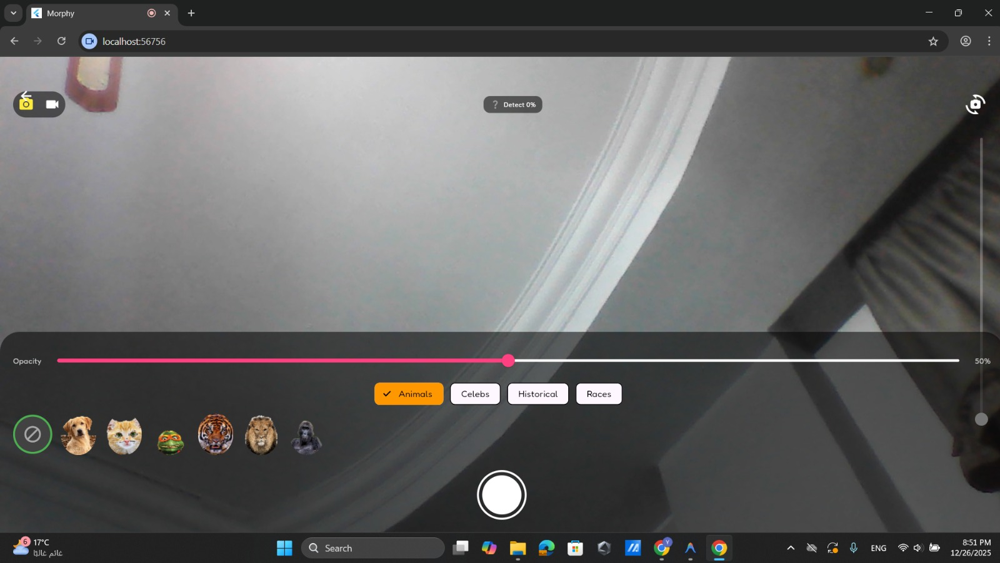
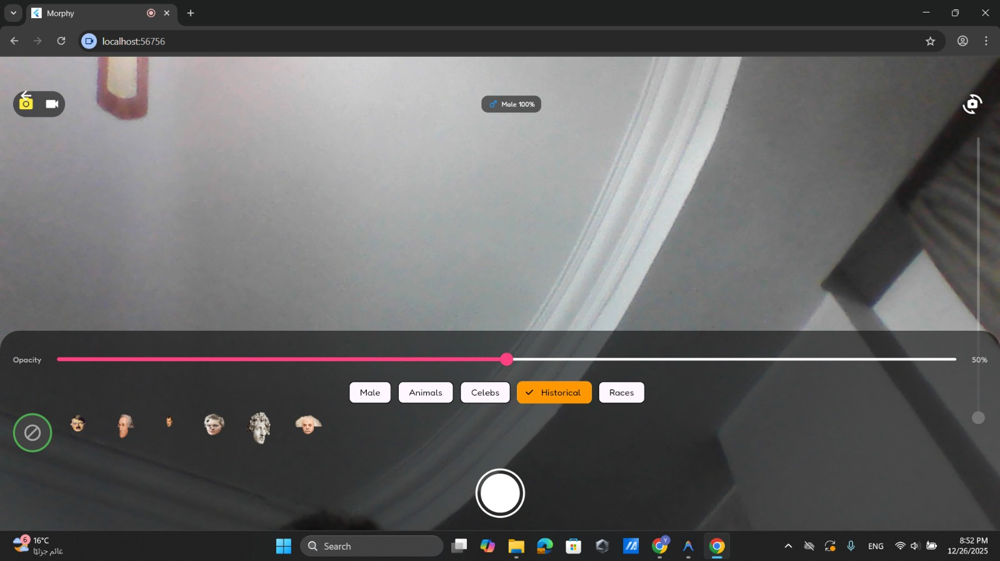
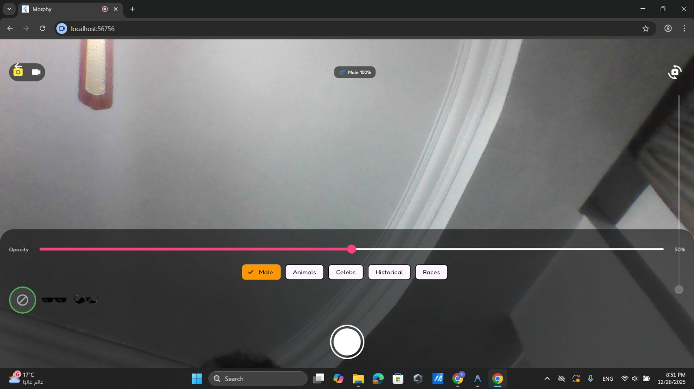
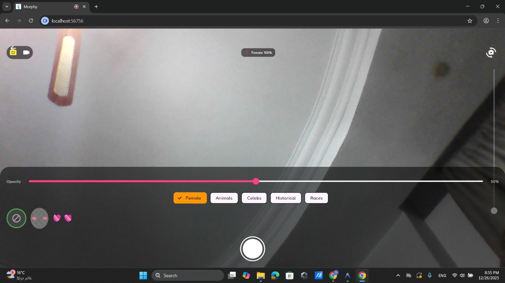

<div align="center">
  
# MORPHY - Face Morphing Mobile App 
A real-time face morphing application that allows users to transform their appearance using advanced image processing and facial manipulation technology.

</p></div>

## Overview 
This mobile application provides real-time face morphing capabilities through the device camera, enabling users to blend their facial features with various preset options including animals, celebrities, historical figures, human races, and accessories. The app uses AI-powered gender detection to intelligently customize available morphing options.

---

## Table of Contents

- [Features](#features)
- [System Architecture](#system-architecture)
- [Technology Stack](#technology-stack)
- [Installation](#installation)
- [Demo Video](#demo-video)
- [Troubleshooting](#troubleshooting])
- [Development Team](#development-team)

---
## Features

### core capabilities 
- **Multi-Platform Support**: Runs on Android, iOS, Windows, macOS, Linux, and Web
- **User Authentication**: Sign in with email and username
- **Theme Customization**: Multiple theme options for personalized experience
- **Real-Time Processing**: Live face morphing directly from camera feed at 30+ FPS
- **AI Gender Detection**: Automatically detects user gender to display appropriate morphing options
- **Morphing Slider**: Smooth transition control between original face (0%) and full morph (100%)
- **Video Recording**: Capture and export morphing sessions as high-quality video files
- **Interactive Audio**: Mouth-triggered sound effects for select filters (plays when mouth opens, stops when closed)
- **Instant Preview**: See transformations in real-time with zero lag
- **Export Options**: Save recordings to device gallery with one tap

###  Five Specialized Categories 
Each category contains 4 unique morphing options:

1. **Animals** - Transform with animal characteristics
2. **Celebrities** - Morph into famous personalities from entertainment and sports
3. **Historical Figures** - Blend features with influential figures from different eras
4. **Human Races** - Explore facial features representing different ethnic backgrounds

<p align="center">
  
  
  <br>
  
  
</p>

5. **Add-ons** - Apply virtual accessories and enhancements according to your gender

<p align="center">
  
  
</p>

---
## System Architecture

```
Morphing-app/
├──  .gitignore                   # Git ignore rules
├──  README.md                    # Main project documentation
├──  .vscode/                     # VS Code workspace settings
│   └── settings.json
│
├──  UI/                          # UI-related Python experiments & assets
│   ├── Face.py                   # Face processing / UI-side testing script
│   └── assets/                   # Images, icons, and UI resources
│
├──  backend/                     # FastAPI backend server
│   ├── main.py                   # FastAPI app entry point & API routes
│   ├── face_service.py           # Core face morphing logic
│   ├── requirements.txt          # Backend Python dependencies
│   ├── output.avi                # Sample recorded morphing output
│   └── __pycache__/              # Python cache files
│
├──  task5_face_app/              # Flutter application (multi-platform)
│   ├── android/                  # Android platform configuration
│   ├── ios/                      # iOS platform configuration
│   ├── linux/                    # Linux desktop support
│   ├── macos/                    # macOS desktop support
│   ├── windows/                  # Windows desktop support
│   ├── web/                      # Web platform support
│   ├── lib/                      # Dart source code (UI & app logic)
│   ├── test/                     # Flutter unit & widget tests
│   ├── pubspec.yaml              # Flutter dependencies
│   ├── pubspec.lock              # Locked dependency versions
│   └── analysis_options.yaml     # Dart analyzer configuration
│
├──  task5_ai_gender/             # AI gender detection module
│   ├── AgeGenderDeepLearning-master/ # Reference deep learning implementation
│   ├── deploy.prototxt           # Model architecture definition
│   ├── gender_net.caffemodel     # Pre-trained gender classification model
│   ├── gender_model.keras        # Keras-based gender model
│   ├── realtime_test.py          # Real-time gender detection test
│   └── train_gender.py           # Gender model training script
│
├──  test_mp.py                    # MediaPipe / multiprocessing test script
├──  verify_backend.py             # Backend verification & testing script
├──  run_backend.bat               # Windows batch script to start backend
└──  info.jpg                      # Project overview / demo image

```
---
## Technology Stack

| Component | Technology | Purpose |
|---------|------------|---------|
| **Mobile Framework** | Flutter 3.0+ | Cross-platform app (Android, iOS, Desktop, Web) |
| **Frontend Language** | Dart 2.17+ | Flutter application development |
| **Backend Framework** | FastAPI (Python) | RESTful API server for face processing |
| **Web Server** | Uvicorn / ASGI | High-performance asynchronous server |
| **Authentication** | Email / Password | User account management |
| **UI Theming** | Flutter Themes | Customizable application appearance |
| **AI** / **ML** | TensorFlow, PyTorch | Gender detection and AI-based models |
| **Image Processing** | OpenCV, NumPy, Pillow | Facial landmark detection and manipulation |
| **Data Validation** | Pydantic | Request and response schema validation |
| **Video Processing** | OpenCV (cv2) | Video recording and encoding |
| **Build System** | C++ / CMake | Native module compilation |

---
## Installation
**Prerequisites**

```bash
# Python Version
Python 3.8 or higher

# Flutter SDK
Flutter 3.0+
Dart SDK 2.17+

# System Requirements
- OS: Android 8.0+ / iOS 12.0+ / Windows 10+ / macOS 10.15+ / Linux (Ubuntu 20.04+)
- RAM: 4GB minimum, 6GB recommended
- Camera: Front-facing camera with 720p resolution minimum
- Storage: 500MB available space
- Internet: Required for initial setup and authentication
```
**Setup Instructions**

1. Clone the Repository
   ```bash
   git clone https://github.com/youssefabdelrauf/Morphing-app
   ```
2. Install Python Dependencies
   ```bash
   pip install fastapi uvicorn pydantic opencv-python numpy pillow tensorflow
   # Or if you have requirements.txt:
   pip install -r requirements.txt
   ```
3. Set Up Flutter Environment
   ```bash
   cd task5_face_app
   flutter pub get
   flutter doctor  # Verify installation
   ```
4. Configure Backend Server
   ```bash
   # Navigate to backend directory
     cd backend

   # Windows
     run_backend.bat

   # Linux/macOS
     uvicorn main:app --reload --host 0.0.0.0 --port 8000
   ```
5. Run Tests
   ```bash
   python test_mp.py
   python verify_backend.py
   ```
6. Launch Mobile Application
   ```bash
   cd task5_face_app

   # Run on connected device
   flutter run

   # Or build for specific platform:
   flutter build apk              # Android APK
   flutter build ios              # iOS
   flutter build windows          # Windows desktop
   flutter build macos            # macOS desktop
   flutter build linux            # Linux desktop
   flutter build web              # Web application
   ```
---

## Demo Video
This video showcases the system workflow, including camera input processing, AI-based gender detection, and real-time face morphing with interactive controls.


https://github.com/user-attachments/assets/8449ec72-7148-4d63-badf-4ef478603fdf


---
## Troubleshooting

### ❌ Camera not detected
```
**Possible solutions:**
1. Check camera permissions in the device settings.
2. Restart the application.
3. Verify that the camera hardware is functioning correctly.
4. Try switching between front and rear cameras.
```

### ❌ Backend connection failed
```
**Possible solutions:**
1. Ensure the backend server is running:
   - **Windows:** `run_backend.bat`
   - **Linux/macOS:**
     ```
     uvicorn main:app --reload
     ```
2. Confirm the backend is accessible at:http://localhost:8000/
3. Verify that CORS settings allow requests from the application.
4. Check firewall settings to ensure local connections are permitted.
5. Review backend logs for error messages (FastAPI logs appear in the terminal).
6. Ensure all required Python dependencies are installed:pip install fastapi uvicorn pydantic opencv-python numpy
```
### ❌ Morphing is laggy or slow
```
**Possible solutions:**
1. Close other running applications.
2. Reduce video resolution in the application settings.
3. Lower morphing quality to **Medium**.
4. Ensure the device meets the minimum system requirements.
5. Clear the application cache and restart.
```
### ❌ Gender detection is incorrect
```
**Possible solutions:**
1. Ensure the face is well-lit and clearly visible.
2. Remove accessories that may obscure facial features.
3. Face the camera directly and avoid extreme angles.
4. Manually override gender detection in the settings if available.
```
### ❌ Video recording not saving
```
**Possible solutions:**
1. Verify that storage permissions are granted.
2. Ensure sufficient storage space is available.
3. Check that the SD card is mounted (Android devices).
4. Try recording shorter clips.
```
### ❌ Mouth detection not working for audio triggers
```
**Possible solutions:**
1. Ensure adequate lighting conditions.
2. Face the camera directly without obstructions.
3. Make clear mouth opening and closing movements.
4. Confirm that microphone permission is granted.
5. Verify that the selected filter supports audio features.
6. Check backend logs for mouth detection errors.
```
### ❌ Sounds not playing with filters
```
**Possible solutions:**
1. Ensure microphone permission is granted (required for mouth detection).
2. Check that device volume is not muted or too low.
3. Verify the backend server is serving sound files from the `/sounds` endpoint.
4. Ensure the `UI/assets` directory contains the required sound files.
5. Test with different filters, as not all filters include audio.
6. Ensure mouth movements are clearly visible to the camera.
7. Review backend logs for audio file loading errors.
```
---
## Development Team

### **Maryam Moustafa**
-  Email: maryam23shabaan@gmail.com
-  [GitHub](https://github.com/maryam305)
-  [LinkedIn](https://www.linkedin.com/in/maryam-moustafa-653257378)


### **Aya Sayed**
-  Email: aya.sayed14827@gmail.com
-  [GitHub](https://github.com/14930)
-  [LinkedIn](https://www.linkedin.com/in/aya-sayed-bb6a80397?utm_source=share_via&utm_content=profile&utm_medium=member_android)

### **Youssef Mahmoud**
-  Email: youssef.abdelrauf23@gmail.com
-  [GitHub](https://github.com/youssefabdelrauf)
-  [LinkedIn](https://www.linkedin.com/in/youssef-mahmoud-abdelrauf-1905b8370)

### **Rahma Ashraf**
-  Email: ashrafrahma402@gmail.com
-  [GitHub](https://github.com/rahmashraf)
-  [LinkedIn](https://eg.linkedin.com/in/rahma-ashraf-717012373)

---
